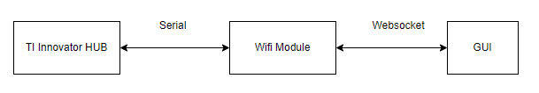
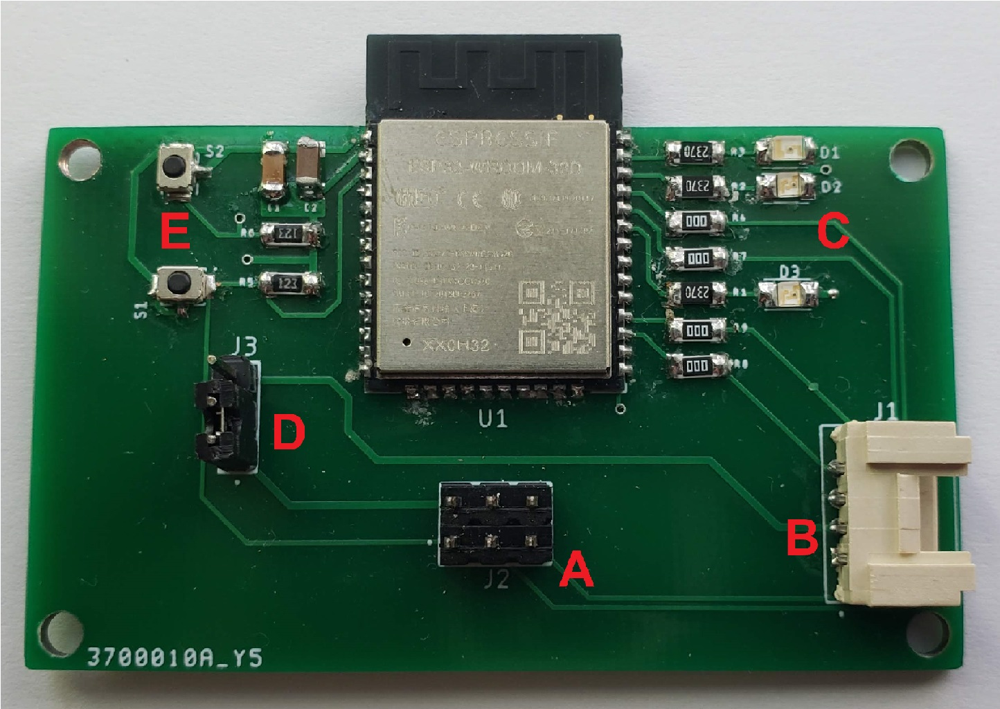

# Wifi Module (ESP32-WROOM-32D)

## Table of Contents

* [Introduction](#introduction)
* [Software](#software)
* [Hardware](#hardware)
* [How to Program using USB to TTL](#how-to-program-using-usb-to-ttl)
* [Bugs and To Do](#bugs-and-to-do)

## Introduction

The wifi Module is connected to the TI Innovator HUB using a grove cable and host the graphical user interface that the user uses from their device. The wifi module communicates over the grove cable using UART at 4Mbps. The GUI sends commands and receives data from the wifi module through 2 websockets. Websocket 1 is for commands from GUI to wifi modules and websocket 2 is for data from wifi module to GUI. The commands received from the GUI are forwarded over UART to the TI Innovator HUB. The data that is sent to the GUI comes from the TI Innovator HUB via UART.

## Software

The firmware was produced using the Arduino IDE. The ESP32 package may need to be installed, [Install ESP package in Arduino](https://docs.espressif.com/projects/arduino-esp32/en/latest/installing.html). The software utilizes the AsyncTCP and ESPAsyncWebServer packages that can be found at [ESPAsyncWebServer](https://github.com/me-no-dev/ESPAsyncWebServer) and [AsyncTCP github](https://github.com/me-no-dev/AsyncTCP).

The firmware can be broken down into a few parts:

1. Webpage GZIP encoded binary arrays. These can be found from line 29 to line 43 (line numbers could change). The creation of these binary arrays can found in the final_gui directory. These arrays contain the complete set of GUI information needed by the webbrowser.
2. Setup and initialization of the Async Server and websocket. The tcp server and websockets are configured to response to certain http request. Each webpage and dependency is routed to a certain http request and is configured to be transmitted using GZIP encoding. The websockets are configured to responde to certain URLs on ports 80 and 81. Also, how the websockets respond to an event is configured in onEvent and onEvent2. The websocket responses are simply to forward data to either the TI Innovator HUB or to the GUI.
3. Loop function. Inside this function, the wifi module monitors UART channel 2 for incoming data from the TI Innovator HUB. When data is found, and both websockets are open, then the HandleDataPacket function is called to handle the incoming data from the TI Innovator HUB. This data is sent to the webpage GUI through websocket 2.

## Hardware

The wifi module uses an ESP32-WROOM-32D on a customized PCB that was designed by Christian Offodile. The PCB pictured below is an earlier revision but maintains similar functionality to our final PCB design. For more information on the final PCB iteration, please look into the schematics directory. 

A.  This 2x3 male header is used by the ESP programmer [ESP-Prog-Board](https://docs.espressif.com/projects/espressif-esp-iot-solution/en/latest/hw-reference/ESP-Prog_guide.html). Alternatively, this header can be used with the pushbuttons to program the ESP32 using a USB to TTYL converter [Example](https://www.amazon.com/gp/product/B07WX2DSVB/ref=ppx_yo_dt_b_asin_title_o01_s00?ie=UTF8&psc=1).

B.  This grove connector is used to connect the Wifi PCB to the TI-Innovator HUB. The connector provides power and a connection to UART2 RX and TX.

C.  These LEDs are from top to bottom: Amber (GPIO 23), Red (GPIO 22), and Green (GPIO 21).

D.  This 3 pin male header is used to choose which power source is to be used. The jumper on the bottom 2 pins is for the programmer supplying power. The top 2 pins are for the grove connector to the TI-Innovator HUB.

E.  These 2 pushbuttons are used to pull the EN and GPIO1 low. EN and GPIO1 are normally pulled high via a pull up resistor. Pulling EN and GPIO-0 low is required to download the firmware if not using the ESP-Prog-Board, or any other programmer that has extra circuitry available to pull the EN and GPIO1 pins low. The pushbuttons were introduced to allow for wider compatibility with programmers.

## How to Program Using USB to TTL

### **Some programmers can be configured for 5v. Ensure that it is not set to 5v. The PCB does not step down the voltage.**

These steps are for those who are using a USB to TTL programmer that does not have a circuit available for pulling EN and GPIO1 low.

1. Arduino IDE and programmer are installed and configured. Arduino has all necessary dependencies installed and programmer has drivers installed.
2. Close any application on your computer that uses the USB to TTL programmer. The UART channel 0 cannot be shared.
3. Apply power (3v3) to the ESP32 via a power source that can provide > 250 mA @ 3v3. The TI Innovator HUB has 3v3 available with max amperage of 500 mA available on the breadboard.
4. Connect ESP32 UART0 TX to programmer RX, connect ESP32 UART0 RX to programmer TX.
5. Ensure that programmer and ESP32 share the same ground reference. Connect programmer ground to ESP32 ground.
6. Determine which COM port the programmer uses and set the Arduino IDE to use that COM port.
7. Begin upload of sketch to ESP32 from Arduino IDE. You will see a message showing that the Arduino IDE is trying to program the ESP32. You will see "___...". At this point you must press the pushbotton that pulls GPIO1 low. Hold that pushbutton until the download begins.
8. Once the download has finished, press the pushbotton that pulls EN low to reset the ESP32. 
9. Once the ESP32 is reset it should begin running the firmware downloaded to it.

Note: You can use a serial terminal, such as [Tera Term](https://ttssh2.osdn.jp/index.html.en) to view what is happening on UART channel 0 using the USB to TTL programmer, while you are not downloading firmwares. For example, if you hold GPIO1 low and press reset, you will see in the serial terminal that the ESP32 goes into serial bootloader mode.

## Bugs and To Do

### To Do
- Add admin page: We want the user to be able to set the SSID and password among other properties. These properties can be stored in static memory and kept after power down and reset.
- Add randomized SSID: Because there will be multiple devices running, the SSIDs cannot collide and so we can use the ESP32 unique MAC address to achieve this.
- Increase operation robustness: As of now, the wifi module operates well, and most hangups result from the TI Innovator HUB. However, the ESP32 has cpu resources that could be dedicated to error checking and handling to help with hangups caused anywhere in the data streaming pipeline.

### Bugs
- The websocket hangs up and quick data speeds. It is suspected that this may have something to do with the buffer. Making the device operation more robust would include adding ways of checking and handling buffer overflow.
